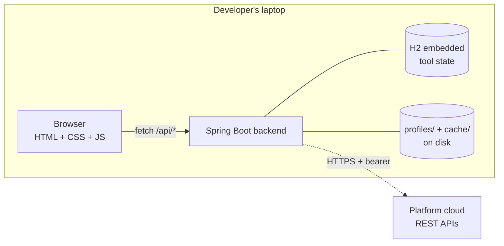
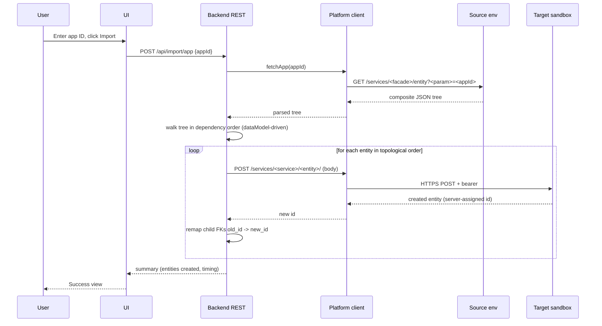

# DevBridge — Project Documentation

**Owner:** [your name] · **Status:** Active · **Last updated:** 2026-08-11

> **Convention for this repo.** These documents will eventually live in a git-hosted repo. Keep them **generic** — no real instance IDs, no internal URLs, no real endpoint names with typos, no real customer data. Use placeholders like `<service-name>`, `<facade-endpoint>`, `<preserved-typo-param>`. Real values live in local project profiles, never here.

## Contents

1. [Project Overview & Objectives](#1-project-overview--objectives)
2. [Architecture & Internal Workflow](#2-architecture--internal-workflow)
3. [Architecture Decision Records (ADRs)](#3-architecture-decision-records-adrs)
4. [Testing & QA Strategy](#4-testing--qa-strategy)
5. [Progress Tracker & Milestones](#5-progress-tracker--milestones)

---

## 1. Project Overview & Objectives

> **How to fill this section.** Answer *what* and *why* in language a new team member (or your manager) could understand in five minutes. Keep it factual — no marketing, no hedging. When the truth changes, update it here first.

### What we're building

DevBridge is a developer productivity tool for WaveMaker-derived low-code platforms. It gives developers a self-service way to export SQL query results, copy applications between environments, and bulk-import scoped datasets for testing — without DBA involvement, per-table workarounds, or manual copy-pasting.

The tool runs on the developer's laptop as a Spring Boot fat JAR with a browser-based UI on `localhost:8080`. It communicates with the platform exclusively over HTTPS using per-project configuration profiles.

### Problem this solves

- Query results from the platform's SQL console can't be downloaded — investigation and reporting are slow
- No per-app import exists; per-table import misses referential dependencies, so debugging apps that only exist in a shared environment is blocked
- Bulk realistic data requires DBA involvement, blocking performance testing and analytics

### Target users

Backend developers on platform-based projects. Initially the author's team; the profile-based design lets other project teams onboard by adding a config file, no code changes.

### Goals (in priority order)

1. **G1.** Export SQL query results in CSV / Excel / JSON self-service.
2. **G2.** Reproduce a full application from a source environment to a target sandbox in one action, with referential integrity preserved.
3. **G3.** Self-service scoped bulk datasets (target: 100–1000 apps) into a target sandbox.
4. **G4.** Support multiple projects with the same binary — new project = new profile, not a rebuild.

### Non-goals

- Not a DBA replacement for production data movement
- Not a general-purpose ETL tool
- Not client-facing; no audit-quality output
- Not multi-user or hosted (v1 is single-user, laptop-run)

### Success criteria

- **Adoption:** ≥3 developers on the author's team using the tool at least weekly by 2 months post-release.
- **Growth (aspirational):** ≥1 additional project team onboards its own profile within 6 months.

### High-level scope (v1)

| Module | Description |
|---|---|
| Module 1 — SQL Runner | Free-form SQL execution + downloadable results |
| Module 2 — App Import | Fetch app from source env, reproduce in target sandbox |
| Module 3 — Bulk Import | Import N apps by criteria into target sandbox |
| *(Deferred)* Module 4 — Job Impact Analyzer | Separate initiative, not in v1 |

---

## 2. Architecture & Internal Workflow

> **How to fill this section.** One diagram at a system level, then component responsibilities as a table, then one sequence diagram per critical flow. Update this whenever a component boundary or a data flow changes. If the diagram no longer matches the code, the diagram is wrong — fix it, don't ignore it.

### System-level view



### Components

| Component | Location | Responsibility |
|---|---|---|
| Browser shell | `static/index.html`, `static/css/`, `static/js/` | Renders UI, hash-based routing, calls `/api/*` via `fetch()` |
| Spring Boot app | `com.devbridge.DevBridgeApplication` | Boots the process, serves static + REST |
| REST controllers | `com.devbridge.api.*` | HTTP endpoints under `/api/*` |
| Profile system | `com.devbridge.profile.*` | Load/save project profiles as JSON files |
| Auth holder | `com.devbridge.auth.*` (planned) | In-memory bearer token per session |
| Platform REST client | `com.devbridge.fawb.*` (planned) | Wraps HTTPS calls to the platform, adds bearer, detects 401 |
| DataModel loader | `com.devbridge.datamodel.*` (planned) | Parses per-project dataModel JSON into an in-memory graph |
| Import orchestrator | `com.devbridge.import.*` (planned) | Walker + ID remap for Module 2/3 |

### Data flow — Fetch and import one application (Module 2)



### Data flow — Run SQL and download results (Module 1)

*Fill in when Module 1 lands. Should include: query submission → backend calls platform SQL API → streaming response → format conversion → download.*

### External dependencies

| Dependency | Purpose | Failure mode | Mitigation |
|---|---|---|---|
| Platform REST APIs | Source of app data + target for imports | 401 (token expired), 5xx (env down), network partition | Detect 401 → prompt user to paste fresh token; retry with exponential backoff on 5xx; user-visible error on partition |
| Per-project dataModel JSON | Metadata for entities, FKs, PK generators, masking | Missing file, unexpected schema in a future platform version | Fail fast on load with a clear message; version-check top-level keys |
| Session at platform | APIs only respond while user is logged in | Log-out mid-run | Retry logic detects 401, prompts user; resume from last successful entity |

### Tech stack summary

- **Runtime:** Java 17, Spring Boot 3.3.5
- **Frontend:** Plain HTML, CSS, ES6 modules (hash-based router, no framework)
- **Persistence:** JSON files under `%USERPROFILE%\.devbridge\` (profiles + caches); H2 embedded for query history (planned)
- **JSON:** Jackson (transitive via Spring Boot Web)
- **Exports:** Apache POI (Excel), OpenCSV (CSV) — added when Module 1 lands
- **Masking:** Java Faker (opt-in) — added when needed
- **Testing:** JUnit 5 + Spring Boot Test + Testcontainers (as needed)
- **Build:** Maven

---

## 3. Architecture Decision Records (ADRs)

> **How to fill this section.** Every non-obvious technical choice becomes an ADR. Write one when: the decision is hard to reverse, when you rejected a viable alternative, or when a future team member would ask "why did we do it this way?" Keep each ADR short — one page or less. **Never delete an ADR** — if it's wrong later, mark it Superseded and link to the replacement.

### ADR log

| # | Title | Status | Date |
|---|---|---|---|
| [001](decisions/adr-001-plain-html-over-vaadin.md) | Plain HTML/CSS/JS over Vaadin | Accepted | 2026-08-11 |
| [002](decisions/adr-002-json-file-profile-storage.md) | JSON-file-per-profile storage | Accepted | 2026-08-11 |
| [003](decisions/adr-003-all-rest-no-jdbc.md) | All-REST architecture (no direct DB access) | Accepted | 2026-08-11 |

### ADR template (copy for new decisions)

Save each ADR as `docs/decisions/adr-NNN-short-slug.md` and add a row to the log above.

```markdown
# ADR NNN — <Short noun phrase, e.g., "Bearer token pasted each session">

- **Status:** Proposed | Accepted | Deprecated | Superseded by ADR-XXX
- **Date:** YYYY-MM-DD
- **Deciders:** [names]

## Context
What's the situation that forced this decision? What constraints exist? What are we trying to enable or protect?

## Decision
The choice, stated in one or two sentences. Direct, not hedged.

## Alternatives considered
- **Option A** — What it is. Why we didn't pick it.
- **Option B** — What it is. Why we didn't pick it.
- **Option C (chosen)** — What it is. Why we picked it.

## Consequences
- **Positive:** What becomes easier / possible / cheaper.
- **Negative:** What becomes harder / more expensive / constrained.
- **Neutral:** Follow-on work this creates.

## References
- Related ADRs
- External docs, tickets, discussions
```

### Sample filled-in ADR (also saved as its own file)

**ADR 001 — Plain HTML/CSS/JS over Vaadin**

- **Status:** Accepted
- **Date:** 2026-08-11

**Context.** The frontend needs a UI. Options considered were Vaadin (Java-first, no JS), React + TypeScript, Vue, Thymeleaf + htmx, and plain HTML + CSS + Vanilla JS with a Spring REST backend. The developer building this project has strong Java + Spring Boot skills and moderate HTML/CSS/JS skills, but no prior React/Vue/TypeScript experience. The tool must be single-user, run on a laptop, and be explainable to interviewers.

**Decision.** Use plain HTML + CSS + ES6 modules with a Spring Boot REST backend. Hash-based routing on the frontend. No JS framework.

**Alternatives considered.**
- **Vaadin** — Pure Java, fastest to a working UI, but the "Java code producing DOM" abstraction felt foreign to the developer and adds a non-transferable skill.
- **React + TypeScript** — Modern, most-transferable skill, best visual polish. Rejected because the developer would be learning React + npm + Vite while also learning the domain — too much cognitive load for a solo-owner project.
- **Thymeleaf + htmx** — Server-rendered HTML with declarative interactivity. Solid choice, but adds htmx as a novel concept when plain vanilla JS is already sufficient at this scale.
- **Plain HTML + Vanilla JS (chosen)** — Familiar to the developer, no learning curve, fully explainable in interviews, no build step for frontend.

**Consequences.**
- **Positive:** Zero JS toolchain to maintain. Every frontend file is a plain source file that renders in-browser without compilation. Explanation-friendly for interviews.
- **Negative:** We hand-roll UI primitives (forms, modals, grids) instead of using library components. Component reuse across views is patterns-based rather than framework-provided.
- **Neutral:** If Module 1's SQL runner needs a rich data grid, we may add a lightweight standalone grid library (e.g., Grid.js) — not a framework, just a component.

---

## 4. Testing & QA Strategy

> **How to fill this section.** Answer: "How do I know this actually works before I let anyone else touch it?" Distinguish automated tests (run in CI, ideally) from manual verification (checklist a human runs). Every module gets a checklist. Every non-obvious edge case gets a row in the edge-case table with expected behavior.

### Testing pyramid

| Layer | What | Tools | Where |
|---|---|---|---|
| Unit | Pure logic (mappers, walkers, ID-remap, formatters) — no I/O | JUnit 5, AssertJ | `src/test/java/**/UnitTest.java` |
| Integration | Backend endpoints + real Spring context + on-disk H2 | Spring Boot Test, `@AutoConfigureMockMvc` | `src/test/java/**/IntegrationTest.java` |
| Contract | HTTPS calls to platform — replayed from recorded fixtures | WireMock or MockWebServer | `src/test/java/**/ContractTest.java` |
| Manual | End-to-end workflows against a real platform environment | Checklists below | Documented per module |

### Manual verification checklists

**Profile system (Phase 1b)**
- [ ] Sidebar shows "Active profile: None selected" on first launch
- [ ] Adding a profile with required fields succeeds; card appears
- [ ] Required-field validation prevents submit when name or base URL is missing
- [ ] Activating a profile updates the sidebar footer with its name
- [ ] Activating a different profile transfers the "Active" badge
- [ ] Deleting the active profile clears the sidebar to "None selected"
- [ ] Profile JSON files exist under `%USERPROFILE%\.devbridge\profiles\<uuid>.json`
- [ ] Restarting the Spring Boot app re-loads all profiles (list is unchanged)
- [ ] Restarting the app does NOT preserve which profile was active (in-memory only)

**Module 1 — SQL Runner** *(fill in when built)*
- [ ] ...

**Module 2 — App Import** *(fill in when built)*
- [ ] ...

**Module 3 — Bulk Import** *(fill in when built)*
- [ ] ...

### Edge cases

| Case | Expected behavior | Test coverage |
|---|---|---|
| Two profiles with the same name | Both persist; UUIDs make them distinct; UI shows both | *TODO — add integration test* |
| Profile JSON file manually corrupted | Repository logs warning and skips; other profiles still load | *TODO — add unit test with malformed JSON fixture* |
| Bearer token expired mid-import | Import halts; UI prompts for new token; user re-enters and resumes | *TODO — will land with FawbClient* |
| App has zero related entities | Fetch returns tree with empty child arrays; import writes only the parent | *TODO — will land with Module 2* |
| App references an entity that doesn't exist in target sandbox | Fail loudly with error message identifying the missing referent | *TODO — will land with Module 2* |

### Acceptance criteria per module

Each module ships when **all** boxes are checked in its section.

**Module 1 — SQL Runner (planned)**
- [ ] Can execute a `SELECT` against active profile's chosen environment
- [ ] Result grid renders paginated results
- [ ] Export as CSV, Excel, and JSON — all downloaded files are structurally valid and open cleanly in their default apps
- [ ] Query history persists across restarts
- [ ] Saving a query and re-running it produces identical results
- [ ] Error responses from platform surface with the platform's message, not a stack trace

**Module 2 — App Import (planned)**
- [ ] Given a valid app ID in source env, importing produces a functioning app in target sandbox
- [ ] All FKs on child entities resolve correctly after import (target-side FK integrity check passes)
- [ ] Dry-run produces the same plan the actual import executes (verified by log comparison)
- [ ] Rollback restores target sandbox to pre-import state on partial-import failure

**Module 3 — Bulk Import (planned)**
- [ ] Importing N=10 apps succeeds; sample-check 3 random imports for structural integrity
- [ ] Importing N=100 apps completes without token refresh (or refreshes cleanly if it happens)
- [ ] Named dataset profile reproduces the same set of source app IDs on re-run

### Regression suite

Every release runs, at minimum:

1. Profile CRUD manual checklist (2 min)
2. Module 1 golden query (1 min)
3. Module 2 known-good app import into a fresh sandbox (10 min)
4. Module 3 named-dataset re-import (15 min)

If any step fails, the release does not ship.

---

## 5. Progress Tracker & Milestones

> **How to fill this section.** Two granularities: a phase-level roadmap (planning) and a chunk-level tracker (execution). Update chunk status the moment it changes — don't batch. When a phase completes, snapshot the tracker to a "Version history" entry at the bottom and roll forward.

### Roadmap

| Phase | Content | Exit criterion | Status | Target |
|---|---|---|---|---|
| **0** | Requirements finalization | `problem-statement.md` approved | ✅ Done | 2026-08-11 |
| **1a** | Repo bootstrap, Vaadin skeleton, later pivoted to plain HTML/JS | Skeleton runs, sidebar navigates, `/api/health` round-trips | ✅ Done | 2026-08-11 |
| **1b** | Domain classes: profile system, auth holder, FAWB REST client, dataModel loader | Active profile drives real REST calls to the platform | 🚧 In progress | *ETA TBD* |
| **1s** | Spike: locate the platform's free-form SQL API | Endpoint path + payload shape documented | ⏳ Pending | *ETA TBD* |
| **2** | Module 1 — SQL Runner + exports | Acceptance checklist all green | ⏳ Pending | |
| **3** | Module 2 — App Import (flagship) | Acceptance checklist all green | ⏳ Pending | |
| **4** | Module 3 — Bulk Import | Acceptance checklist all green | ⏳ Pending | |
| **5** | Hardening, docs, team rollout | ≥3 developers using it weekly | ⏳ Pending | |
| **6** | *(Deferred)* Module 4 — Job Impact Analyzer | Separate initiative | 🅿️ Parked | |

**Status legend:** ✅ Done · 🚧 In progress · ⏳ Pending · 🅿️ Parked · ⚠️ Blocked

### Current phase chunk tracker

**Phase 1b — Domain classes**

| # | Chunk | Status | Notes |
|---|---|---|---|
| 1b.1 | `ProjectProfile` record | ✅ Done | 10 fields + timestamps |
| 1b.2 | `ProfileRepository` (JSON file per profile) | ✅ Done | `%USERPROFILE%\.devbridge\profiles\` |
| 1b.3 | `ActiveProfileHolder` (in-memory) | ✅ Done | Not persisted across restarts |
| 1b.4 | `ProfileService` + `ProfileController` | ✅ Done | CRUD + activate |
| 1b.5 | Frontend Profiles view (list + add + activate + delete) | ✅ Done | Form driven by `FIELDS` array |
| 1b.6 | Sidebar shows active profile | ✅ Done | Refreshes on `profile-changed` event |
| 1b.7 | `AuthTokenHolder` | ⏳ Pending | In-memory bearer holder |
| 1b.8 | Token-paste modal on frontend | ⏳ Pending | Triggered on missing / expired token |
| 1b.9 | `FawbClient` (HTTPS wrapper + bearer + 401 detection) | ⏳ Pending | |
| 1b.10 | "Test connection" button on profile card | ⏳ Pending | Hits a platform health endpoint |
| 1b.11 | `DataModelLoader` (parses `*_published_dataModel.json`) | ⏳ Pending | |

### Blockers

| # | Blocker | Owner | Since | Notes |
|---|---|---|---|---|
| *None currently* | | | | |

### Weekly log (optional — worth keeping for the OKR narrative)

- **2026-08-11** — Requirements locked, `problem-statement.md` v1.0 approved. Phase 1a skeleton bootstrapped in Vaadin, then rebuilt in plain HTML/JS after developer preference change. Phase 1b started; profile system landed end-to-end (backend CRUD + frontend view + sidebar integration).

### Version history

- **v0.1.0-SNAPSHOT** (in progress) — Phase 1 foundation; profile CRUD working.

---

## Appendix: file & folder conventions

- **Documentation:** `docs/PROJECT.md` (this file), `docs/decisions/adr-NNN-slug.md` for individual ADRs
- **Real project profiles:** `%USERPROFILE%\.devbridge\profiles\` — never committed
- **Cached data model JSONs:** `%USERPROFILE%\.devbridge\cache\` — never committed
- **Placeholders in docs:** wrap FICO-specific concepts in angle brackets: `<service-name>`, `<preserved-typo-param>`

## Appendix: how to review this document

- Skim the Overview each Monday — is anything stale?
- Update the Progress Tracker at the moment a status changes
- Add an ADR whenever you make a non-obvious tech choice
- Fix the architecture diagram before merging any code that violates it
