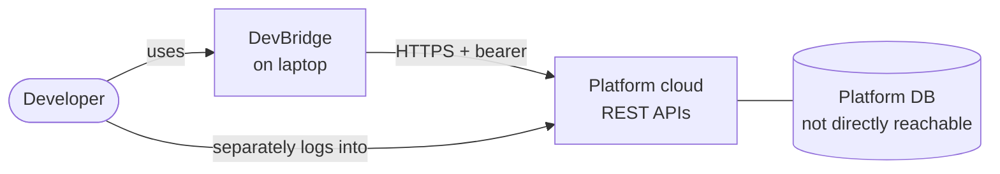
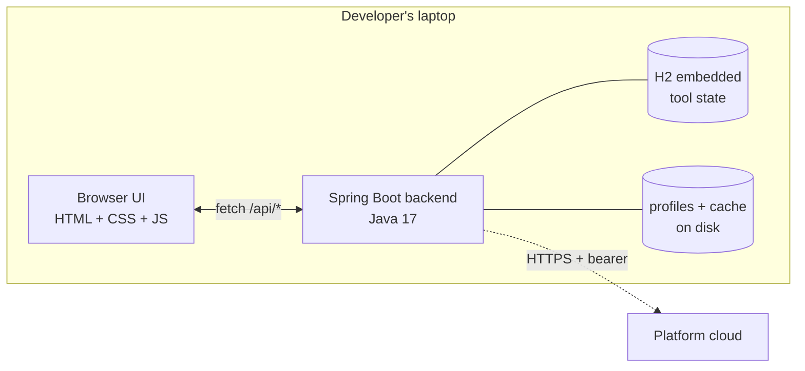
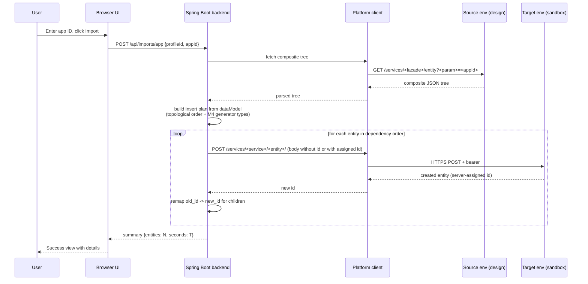
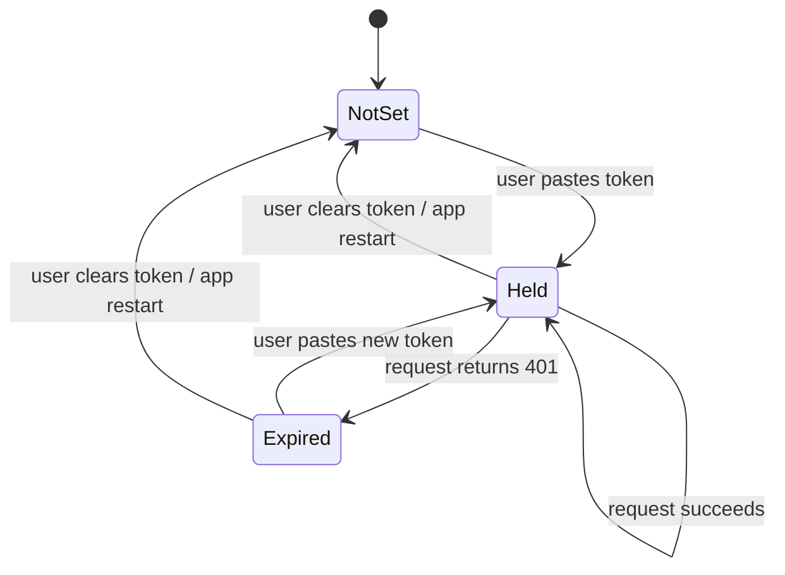
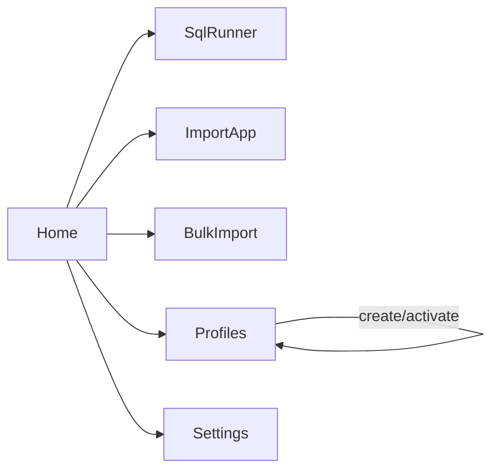

# DevBridge — Master Project Review

| | |
|---|---|
| **Document version** | v0.1 — Draft |
| **Review round** | Round 1 — Foundation review |
| **Last updated** | 2026-08-11 |
| **Author** | [your name] |
| **Status** | 🟡 Draft — pending distribution |
| **Related documents** | [`PROJECT.md`](PROJECT.md) (internal working doc), [`../problem-statement.md`](../../problem-statement.md) |

> **Purpose.** This is the *point-in-time* master review file, distributed to cross-functional stakeholders for approval. Unlike `PROJECT.md` (which is a continuously-updated working document), this file is **versioned per review round**: freeze it when circulating, capture sign-offs, then start a new version for the next round.

> **How to use this file.**
> Each section is optimized for a specific reviewer role — see the routing map below. Reviewers should navigate directly to their section, leave comments (inline or in the approval matrix at the end), and sign off. Authors: fill each section using the placeholder instructions provided, then remove the instruction lines before circulating.

### Reviewer routing map

| Section | Primary reviewers | Est. reading time |
|---|---|---|
| [1. Executive Summary](#1-executive-summary) | Product owner, business stakeholders, project manager | 5 min |
| [2. System Architecture & Data Flows](#2-system-architecture--data-flows) | Tech lead, backend engineers, frontend engineers | 15 min |
| [3. AI & Data Governance](#3-ai--data-governance) | AI/ML engineers, data governance | 5 min (currently N/A) |
| [4. Security, Compliance & Idempotency](#4-security-compliance--idempotency) | Security manager, tech lead, DPO | 15 min |
| [5. UI/UX & API Contracts](#5-uiux--api-contracts) | Frontend engineers, backend engineers, designer | 15 min |
| [6. Unified QA & Approval Trackers](#6-unified-qa--approval-trackers) | All reviewers | 10 min |

---

## 1. Executive Summary

> **Primary reviewers:** Product owner, business stakeholders, project manager.
> **How to fill this section.** No jargon. A stakeholder should be able to say "yes we should fund/staff this" or "no, and here's why" after reading only this section. Lead with the ask, follow with the value, close with the timeline and the required decision.

### 1.1 The ask

We are asking for [approval / staffing / continued time allocation] to build DevBridge, a cross-project developer productivity tool. Estimated total investment: **[X person-weeks]** over **[N weeks]** calendar time.

### 1.2 What we are building — in two sentences

DevBridge is a self-service developer tool that lets engineers export SQL query results, copy applications between platform environments, and populate test sandboxes with scoped realistic data — all without DBA involvement or manual per-table workarounds.

The tool runs on the developer's laptop as a single Java process; it talks to the platform's existing REST APIs and requires no changes to the platform itself.

### 1.3 Business justification

| Metric | Current state | With DevBridge |
|---|---|---|
| Time to reproduce an app-level defect locally | *[fill: e.g., 2-4 hours, if possible at all]* | *[target: e.g., <10 min]* |
| DBA tickets per month for scoped dev datasets | *[fill: e.g., 15/mo]* | *[target: <3/mo]* |
| SQL result reporting turnaround | *[fill: minutes to hours, error-prone copy-paste]* | *[target: 1 export click]* |
| Onboarding a new project team | *[fill: bespoke per project]* | *[target: add a config profile]* |

### 1.4 Target users & impact

- **Primary:** Backend developers on the platform team (initial rollout: author's immediate team).
- **Secondary (growth):** Other project teams — each onboards by creating a config profile, no code change to the tool.

### 1.5 Success metrics

| # | Metric | Target | When measured |
|---|---|---|---|
| M1 | Weekly active users on author's team | ≥3 | End of month 2 post-release |
| M2 | Developer-reported time saved per defect fix | ≥60 min | End of month 3 post-release |
| M3 | Other project teams onboarded | ≥1 | End of month 6 post-release |

### 1.6 Roadmap timeline

| Phase | Description | Target completion |
|---|---|---|
| Phase 0 | Requirements finalization | ✅ 2026-08-11 |
| Phase 1 | Foundation (skeleton, profile system, REST client, dataModel loader) | *[target date]* |
| Phase 1s | SQL API discovery spike | *[target date]* |
| Phase 2 | Module 1 — SQL Runner | *[target date]* |
| Phase 3 | Module 2 — App Import (flagship) | *[target date]* |
| Phase 4 | Module 3 — Bulk Import | *[target date]* |
| Phase 5 | Hardening + team rollout | *[target date]* |

### 1.7 Investment summary

- **Effort:** *[N person-weeks total; broken down by phase]*
- **Tooling / license cost:** None — all open source.
- **Ongoing:** *[maintenance % of author's time post-launch]*.

### 1.8 Risks the stakeholder should know about

- **R1.** The platform's free-form SQL API existence is assumed but not yet verified. If absent, Module 1 scope shrinks.
- **R2.** Adoption depends on team behavior change. Mitigated by shipping Module 1 first (low friction) and involving 2–3 early-adopter developers in feedback.
- **R3.** Manager-only approval — if priorities shift mid-build, phases beyond Module 1 could stall. Mitigated by making each module ship-independently.

### 1.9 Executive sign-off

- [ ] **Product owner / manager** — I approve the scope, timeline, and investment. Name: ___________________ Date: ___________
- [ ] **Sponsor (if separate)** — Name: ___________________ Date: ___________

---

## 2. System Architecture & Data Flows

> **Primary reviewers:** Tech lead, backend engineers, frontend engineers.
> **How to fill this section.** Show the system at three levels: (a) context — where it sits relative to external systems, (b) container — internal processes and stores, (c) sequence — how data flows through the critical paths. State-machines for any non-trivial lifecycle. Every diagram is *authoritative* — if code disagrees, fix the code or fix the diagram before merging.

### 2.1 System context



### 2.2 Container view



### 2.3 Component inventory

| Component | Package | Responsibility | Status |
|---|---|---|---|
| Browser shell | `static/index.html` + `static/js` | UI, hash routing, `fetch()` calls | ✅ Done |
| Spring Boot bootstrap | `com.devbridge.DevBridgeApplication` | Process entry point | ✅ Done |
| REST controllers | `com.devbridge.api.*` | HTTP endpoints under `/api/*` | Partial |
| Profile system | `com.devbridge.profile.*` | Persist project configs as JSON files | ✅ Done |
| Auth token holder | `com.devbridge.auth.*` | In-memory bearer token | ⏳ Planned |
| Platform REST client | `com.devbridge.fawb.*` | HTTP client, bearer header, 401 detection | ⏳ Planned |
| DataModel loader | `com.devbridge.datamodel.*` | Parse per-project `*_published_dataModel.json` | ⏳ Planned |
| Import orchestrator | `com.devbridge.imports.*` | Walker + ID remap for Module 2/3 | ⏳ Planned |
| SQL runner | `com.devbridge.sql.*` | Free-form SQL execution + export | ⏳ Planned |

### 2.4 Critical data flow — Import one app (Module 2)



### 2.5 Critical data flow — Bulk N-app import (Module 3)

*[Fill in when designed. Reuses the Module 2 walker per app; adds a queue/progress mechanism, token-refresh handling mid-run, and resume-from-last-successful-app on failure.]*

### 2.6 State machine — Auth token lifecycle



### 2.7 State machine — Import job lifecycle *(planned)*

*[Fill in when Module 2 lands. Suggested states: Requested → Fetching → Planning → Executing → Completed | Failed | Cancelled.]*

### 2.8 Integration touchpoints

| Integration | Direction | Protocol | Auth | Purpose |
|---|---|---|---|---|
| Platform REST APIs (design env) | Outbound | HTTPS | Bearer `WM_AUTH_TOKEN` | Fetch app trees, run SQL |
| Platform REST APIs (target sandbox) | Outbound | HTTPS | Bearer `WM_AUTH_TOKEN` | POST entities for import |
| Local filesystem | R/W | File I/O | OS user permissions | Profiles + dataModel cache |
| Embedded H2 | R/W | JDBC (in-process) | None (embedded) | Query history *(planned)* |

### 2.9 Non-functional requirements

| Requirement | Target | Notes |
|---|---|---|
| Startup time | < 10 s | Cold start on Windows laptop |
| Single-app import | < 60 s for a typical 30-table app | Depends on platform latency |
| Bulk import (1000 apps) | < 60 min | Assumes stable session; may require token refresh mid-run |
| Availability | Single-user, on-demand | Not applicable (no uptime target) |
| Concurrency | 1 developer per process | No multi-user support in v1 |
| Local storage footprint | < 100 MB including cached dataModel JSONs | |

### 2.9 Engineering sign-off

- [ ] **Tech lead** — Architecture is coherent and buildable. Name: ___________________ Date: ___________
- [ ] **Backend engineer** — Backend components are scoped correctly. Name: ___________________ Date: ___________
- [ ] **Frontend engineer** — Frontend architecture is coherent. Name: ___________________ Date: ___________

---

## 3. AI & Data Governance

> **Primary reviewers:** AI/ML engineers, data governance officer.
> **How to fill this section.** For any AI/ML component: describe the model, training data, deployment, guardrails, fallback, and monitoring. If the project *has no AI/ML*, keep the section but mark it Not Applicable with a brief statement — that way reviewers know it was considered, not overlooked. Revisit if AI capabilities are added.

### 3.1 Applicability

**Status:** ❌ Not applicable to DevBridge v1.

DevBridge is a pure data-movement and automation tool. There are no ML models, no LLM calls, no learned components, no training data. All logic is deterministic: schema-driven walkers, ID remap tables, JSON parsing, HTTP calls.

**Future triggers that would activate this section:**

- Adding **natural-language SQL** ("show me all applications from last week where status is X") — would require an LLM integration
- Adding **automatic PII detection** in query results — would require an ML classifier
- Adding **anomaly detection** on bulk imports — would require a statistical or ML model
- Adding **schema-drift auto-suggestion** — could be heuristic (no ML) or ML-based

### 3.2 Model architecture

*[Fill when applicable: model type (LLM / classifier / regressor), size, provider, whether hosted or API, fine-tuning strategy.]*

### 3.3 Training / evaluation pipelines

*[Fill when applicable: data sources, preprocessing, train/eval split, retraining cadence.]*

### 3.4 Data preprocessing

*[Fill when applicable: normalization, tokenization, filtering, redaction of PII before inference.]*

### 3.5 Context boundaries

*[Fill when applicable: what the model is allowed to see, what it is not; e.g., "the model only receives column names and query intent, never row values".]*

### 3.6 Fallback mechanisms

*[Fill when applicable: what happens when the model is down, times out, returns low-confidence output, or produces disallowed content.]*

### 3.7 Model versioning & rollback

*[Fill when applicable: versioning scheme, A/B or shadow deployment, rollback procedure.]*

### 3.8 Bias, fairness, explainability

*[Fill when applicable: what bias vectors were tested, how outputs are made explainable to end users.]*

### 3.9 AI sign-off

- [x] **N/A — no AI components in v1.** Reviewed and confirmed: ___________________ Date: ___________

---

## 4. Security, Compliance & Idempotency

> **Primary reviewers:** Security manager, tech lead, data protection officer.
> **How to fill this section.** Threat model first (what could go wrong, who benefits), then controls (how we prevent it), then verifiable checks (how we prove the controls hold). The idempotency table is non-optional for any mutating operation.

### 4.1 Threat model summary (STRIDE-lite)

| # | Threat | Category | Applies? | Mitigation |
|---|---|---|---|---|
| T1 | Bearer token stolen from developer's laptop | Info disclosure | Yes | Token held **in memory only**, never persisted. Re-paste per session. Session-scoped to platform's 30-min TTL. |
| T2 | Malicious profile JSON injected into `.devbridge/profiles/` | Tampering | Low | Repository validates required fields on load; rejects malformed. |
| T3 | XSS via unsanitized profile fields | Tampering / info disclosure | Yes | All user-supplied text is HTML-escaped in the UI (`escapeHtml`). |
| T4 | Import operation replayed and duplicates data in target sandbox | Repudiation / duplication | Yes | Idempotency by design (see §4.5). |
| T5 | Query result export accidentally includes PII | Info disclosure | Yes (if masking off) | Optional masking on export (Java Faker). |
| T6 | Tool used against unauthorized environments (staging, prod) | Privilege misuse | Yes | Profile only accepts sandbox + design instance IDs; UI warns on any other. |
| T7 | Man-in-the-middle on HTTPS calls to platform | Info disclosure | Low | TLS to platform; no cert pinning in v1. Documented residual risk. |

### 4.2 Authentication protocols

| Auth surface | Mechanism | Notes |
|---|---|---|
| Developer → platform | Bearer token (`WM_AUTH_TOKEN`) obtained via FICO Analytics SSO | Token TTL 30 min. Developer copies from active browser session and pastes into tool. |
| Developer → tool | None — tool binds to `localhost:8080` only | Firewall reliance; document. |
| Tool → platform | Bearer forwarded from `AuthTokenHolder` | 401 detection triggers re-paste modal. |

### 4.3 Authorization

- Tool has no roles; single-user, single-developer scope.
- Platform-side authorization is inherited from the developer's account (`SystemValidation` role plus per-endpoint domain roles). If a developer lacks a role for a specific endpoint, the platform returns 403 → tool surfaces the message unchanged.

### 4.4 Encryption

| Data | At rest | In transit |
|---|---|---|
| Bearer token | Memory only, never persisted | HTTPS (TLS 1.2+) |
| Project profiles | Plain JSON on disk under user's home | N/A (local) |
| DataModel JSON cache | Plain JSON on disk | N/A (local) |
| Query results (in-memory) | Streamed to file if exported (plain) | HTTPS from platform |
| Query history *(planned)* | H2 embedded (plain) | N/A (local) |

**Rationale for plain on-disk storage of profiles:** Profiles hold no secrets (base URLs, instance IDs, service names). The one secret in the system — the bearer token — is never written to disk. If profile encryption is later required (e.g., masking is added to conceal endpoint typos), we'll evaluate OS keychain (Windows DPAPI, macOS Keychain).

### 4.5 Idempotency guarantees (critical)

> Every mutating operation has an explicit idempotency contract. State the guarantee, the mechanism, and how a reviewer can verify it.

| Operation | Idempotent? | Mechanism | Verification |
|---|---|---|---|
| `GET /api/health` | Yes (read-only) | N/A | — |
| `GET /api/profiles` | Yes (read-only) | N/A | — |
| `POST /api/profiles` | **No** by design — each call creates a new profile with a fresh UUID | UUID generation server-side | Manual: call twice with same body, get two profiles with distinct IDs |
| `PUT /api/profiles/{id}` *(planned)* | Yes | Deterministic overwrite by `id` | Automated: call twice, DB state unchanged after second |
| `DELETE /api/profiles/{id}` | Yes | Second call returns `{"deleted": false}` but end state is identical | Automated |
| `POST /api/profiles/{id}/activate` | Yes | Activating an already-active profile is a no-op (except `lastUsedAt`) | Automated |
| `POST /api/imports/app` *(planned)* | **Must be yes** — critical | Idempotency key `{profileId, sourceAppId}` — repeat calls detect existing import and return the prior result | Automated: repeat call, no duplicate rows in target sandbox |
| `POST /api/imports/bulk` *(planned)* | **Must be yes** — critical | Idempotency key `{datasetProfileId, runId}`; each entity gets a `(sourceId, runId)` composite check | Automated: interrupted and resumed run does not double-import |

### 4.6 Audit logging

| Event | Logged? | Retention |
|---|---|---|
| Profile created / deleted / activated | Yes (INFO to console + rolling file) | 7 days local file, no rotation to remote |
| Import job started / completed / failed | Yes with correlation ID | 7 days local file |
| SQL queries executed | Yes with truncated SQL text (no result rows) | 7 days local file |
| Token pasted / cleared | Yes (event only, never the value) | 7 days local file |

Local logs never leave the developer's machine.

### 4.7 Compliance mapping

| Concern | Applies? | Note |
|---|---|---|
| GDPR / CCPA / GLBA | Indirect | Real PII must not reach dev laptops. Design env PII is stated to be fake; masking-on-export available if that changes. |
| SOC 2 | No | Not a hosted service; single-user local tool. |
| Internal data governance | Yes | Documented that source and target envs are limited to sandbox + design. |

### 4.8 Security sign-off

- [ ] **Security manager** — Threat model, controls, and idempotency guarantees are acceptable. Name: ___________________ Date: ___________
- [ ] **Tech lead** — Idempotency implementation matches the design. Name: ___________________ Date: ___________
- [ ] **Data governance / DPO** — Data classification and residency are acceptable. Name: ___________________ Date: ___________

---

## 5. UI/UX & API Contracts

> **Primary reviewers:** Frontend engineers, backend engineers, designer (if applicable).
> **How to fill this section.** Frontend engineers care about component boundaries and navigation; backend engineers care about endpoint contracts (path, method, request, response, errors). Both need to see error handling patterns spelled out — that's where 80% of integration bugs live.

### 5.1 Component inventory (frontend)

| Component | Type | Location | Purpose |
|---|---|---|---|
| App shell | HTML | `static/index.html` | Sidebar + top bar + view container |
| View modules | ES6 modules | `static/js/views/*.js` | One per screen; export `{title, render(), mount?}` |
| Router | ES6 module | `static/js/router.js` + `main.js` | Hash-based route table |
| API client | ES6 module | `static/js/api.js` | Thin `fetch()` wrapper for `/api/*` |
| Theme tokens | CSS variables | `static/css/main.css` | Colors, spacing, radii — single source of truth |

### 5.2 Navigation model



- Sidebar is always visible; nav is stateless.
- View state is not preserved across navigation (v1 acceptable — most screens are transient).
- Active profile and backend status are always visible in the sidebar footer.

### 5.3 Layout state

| State | UI treatment |
|---|---|
| No profile exists | Home shows an inline hint; sidebar shows "None selected" |
| No token pasted | Modal prompts for token on first action requiring auth *(planned)* |
| Token expired | Modal re-prompts, retries the failed action *(planned)* |
| Backend unreachable | Status dot turns red; all API-dependent actions display error |
| In-progress bulk import | Progress bar visible, cancel button offered *(planned)* |

### 5.4 Mockups

*[Fill by embedding or linking wireframes. Suggested: a screenshot of each view once implemented, or linked mockup files if pre-implementation.]*

### 5.5 API contracts

> **Convention.** Every endpoint: path, method, auth, request schema, success response, error responses. If a response can be `204`, say so.

#### `GET /api/health`

- **Auth:** None
- **Request:** —
- **Response 200:**
  ```json
  { "status": "ok", "app": "DevBridge", "version": "0.1.0-SNAPSHOT" }
  ```
- **Errors:** —

#### `GET /api/profiles`

- **Auth:** None (local)
- **Request:** —
- **Response 200:**
  ```json
  [{
    "id": "uuid",
    "name": "My Project",
    "fawbBaseUrl": "https://example.com",
    "sandboxInstanceId": "…",
    "designInstanceId": "…",
    "dbServiceName": "…",
    "facadeServicePath": "…",
    "facadeEndpoint": "…",
    "facadeQueryParam": "…",
    "dataModelJsonPath": "…",
    "createdAt": "ISO-8601",
    "lastUsedAt": "ISO-8601 | null"
  }]
  ```

#### `GET /api/profiles/active`

- **Response 200:** One `ProjectProfile` (as above)
- **Response 204:** No content — no active profile

#### `POST /api/profiles`

- **Request:** `ProjectProfile` (id and timestamps ignored / regenerated server-side)
- **Response 200:** created `ProjectProfile` with server-assigned `id` and `createdAt`
- **Errors:** `400` on missing required fields *(planned validation)*

#### `DELETE /api/profiles/{id}`

- **Response 200:** `{"deleted": true | false}`

#### `POST /api/profiles/{id}/activate`

- **Response 200:** the activated `ProjectProfile`
- **Response 404:** if `id` unknown

#### Planned endpoints (Phase 1b–4)

| Endpoint | Purpose |
|---|---|
| `POST /api/auth/token` | Set bearer token in memory |
| `DELETE /api/auth/token` | Clear bearer |
| `GET /api/auth/status` | Report whether token is set |
| `POST /api/profiles/{id}/test-connection` | Ping platform with active token |
| `POST /api/sql` | Execute free-form SQL, streamed response |
| `GET /api/sql/history` | Recent queries |
| `POST /api/imports/app` | Import one application |
| `POST /api/imports/bulk` | Import N applications by criteria |
| `GET /api/imports/{jobId}` | Job status |

### 5.6 Error handling patterns

| Layer | Pattern |
|---|---|
| Frontend `api.js` | Throws on non-2xx with `${status} ${statusText}: ${body}` |
| View code | `try/catch` around API calls; `alert()` for v1, replaced by toast in Phase 5 |
| Backend controllers | Explicit `ResponseEntity` with meaningful HTTP codes; body includes `{error, message}` |
| Backend on unexpected exceptions | `@ControllerAdvice` catches and returns `500` with `{error: "internal", requestId: "..."}` *(planned)* |
| Auth 401 from platform | Bubbled up to frontend which triggers the token-paste modal *(planned)* |

### 5.7 Accessibility

- Semantic HTML landmarks (`<aside>`, `<main>`, `<nav>`, `<header>`)
- Focus visible on all interactive controls (browser default retained)
- ARIA labels on nav items and status dot *(TODO)*
- Color contrast meets WCAG AA for primary text against sidebar and main backgrounds *(verified via WebAIM contrast checker)*

### 5.8 UI/API sign-off

- [ ] **Frontend engineer** — Component boundaries and navigation model are workable. Name: ___________________ Date: ___________
- [ ] **Backend engineer** — API contracts are complete and consistent. Name: ___________________ Date: ___________
- [ ] **Designer** (optional) — Visual system and interaction patterns are acceptable. Name: ___________________ Date: ___________

---

## 6. Unified QA & Approval Trackers

> **Primary reviewers:** All. This section is the shared source of truth for whether the project is ready to ship.

### 6.1 End-to-end test scenarios

| # | Scenario | Modules touched | Status |
|---|---|---|---|
| E1 | Add a profile, activate it, sidebar reflects change | Profile system | ✅ Manually verified 2026-08-11 |
| E2 | Restart the app; profiles reload, no active profile | Profile system | ⏳ To automate |
| E3 | Paste token, hit test-connection, see success | Auth + platform client | ⏳ Not yet built |
| E4 | Run a golden SQL query, download CSV / Excel / JSON | Module 1 | ⏳ Not yet built |
| E5 | Import a known-good source app into a fresh sandbox; verify entity counts and FK integrity | Module 2 | ⏳ Not yet built |
| E6 | Bulk-import 10 apps; verify all present in target | Module 3 | ⏳ Not yet built |
| E7 | Bulk-import interrupted by token expiry; resume; no duplication | Module 3 + auth + idempotency | ⏳ Not yet built |

### 6.2 Acceptance criteria per module

**Profile system (Phase 1b)** — all must pass before Phase 2 begins
- [x] CRUD works end-to-end with disk persistence
- [x] Active profile display in sidebar updates via custom event
- [ ] Test-connection button verifies platform reachability *(Phase 1b remaining)*
- [ ] Missing / invalid required fields blocked with clear UI feedback *(Phase 1b remaining)*

**Module 1 — SQL Runner** — all must pass before Phase 3 begins
- [ ] Free-form SQL executes against active profile's chosen env
- [ ] Results paginate in the UI
- [ ] Export as CSV / Excel / JSON — files structurally valid
- [ ] Query history persists across restarts

**Module 2 — App Import**
- [ ] End-to-end import for one representative app succeeds
- [ ] FK integrity on target verified after import
- [ ] Dry-run plan matches actual execution
- [ ] Idempotency: re-running the same import does not duplicate

**Module 3 — Bulk Import**
- [ ] N=10 sample succeeds; three random imports pass integrity check
- [ ] N=100 completes within perf target
- [ ] Named dataset profile reproduces the same set on re-run

### 6.3 Approval matrix

| Section | Role | Reviewer | Status | Date | Notes |
|---|---|---|---|---|---|
| 1. Executive Summary | Product owner | | ⏳ | | |
| 1. Executive Summary | Sponsor (if any) | | ⏳ | | |
| 2. System Architecture | Tech lead | | ⏳ | | |
| 2. System Architecture | Backend engineer | | ⏳ | | |
| 2. System Architecture | Frontend engineer | | ⏳ | | |
| 3. AI & Data Governance | AI engineer | | ✅ | 2026-08-11 | Confirmed N/A |
| 4. Security, Compliance, Idempotency | Security manager | | ⏳ | | |
| 4. Security, Compliance, Idempotency | Tech lead | | ⏳ | | |
| 4. Security, Compliance, Idempotency | DPO / data governance | | ⏳ | | |
| 5. UI/UX & API Contracts | Frontend engineer | | ⏳ | | |
| 5. UI/UX & API Contracts | Backend engineer | | ⏳ | | |
| 5. UI/UX & API Contracts | Designer (optional) | | — | | |
| 6. QA & Trackers | All | | ⏳ | | |

**Status legend:** ✅ Approved · ⏳ Pending · ⚠️ Changes requested · ❌ Rejected · — N/A

### 6.4 Live progress tracker (rolls up from `PROJECT.md`)

See [`PROJECT.md` § 5](PROJECT.md#5-progress-tracker--milestones) for the always-current phase and chunk tracker. This section is a *snapshot* frozen at review time.

**Snapshot as of 2026-08-11:**

| Phase | Status | Notes |
|---|---|---|
| 0 — Requirements | ✅ Done | problem-statement v1.0 locked |
| 1a — Repo bootstrap | ✅ Done | HTML/CSS/JS + Spring Boot |
| 1b — Domain classes | 🚧 In progress | Profile system done; auth + REST client + dataModel loader pending |
| 1s — SQL API spike | ⏳ Pending | |
| 2 — Module 1 | ⏳ Pending | |
| 3 — Module 2 | ⏳ Pending | |
| 4 — Module 3 | ⏳ Pending | |
| 5 — Rollout | ⏳ Pending | |

### 6.5 Open questions & risks (pre-approval)

| # | Question / Risk | Owner | Resolution needed by |
|---|---|---|---|
| Q1 | Does the platform actually expose a free-form SQL API? | Author | Before Phase 2 kicks off |
| Q2 | Bulk-import perf target of 1000 apps / 60 min — realistic given REST overhead? | Author + tech lead | Before Phase 4 kicks off |
| Q3 | Is the FICO Analytics bearer token format stable across platform upgrades? | Author | Ongoing |

### 6.6 Overall project sign-off

**All the above sections must be ✅ Approved before this box is ticked.**

- [ ] **Project approved to proceed with current scope, timeline, and controls.** Signed by: ___________________ (final approver) Date: ___________

---

## Appendix — Document conventions

- **Placeholders in text:** `[fill this in]`, `<placeholder>`, or *[italic guidance]*. Remove or replace before circulation.
- **Real values (endpoint typos, instance IDs, customer data):** never in this file. Use `<preserved-typo-param>`, `<sandbox-instance-id>`, etc.
- **Every mutating API endpoint:** must appear in §4.5 (idempotency table). No exceptions.
- **Every diagram:** authoritative. If it disagrees with code, one of them is wrong — fix, don't ignore.
- **New review round:** copy this file to `PROJECT_REVIEW-v0.2.md` (or new page), reset all sign-offs, update the header.
